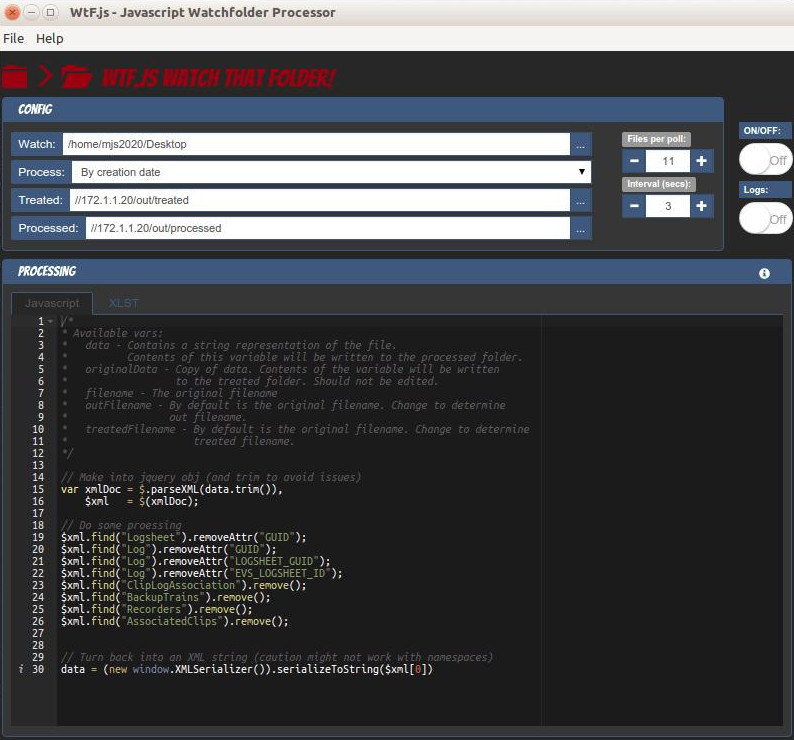

## WtF.js (Watch that Folder) Javascript Watchfolder Processor

### Description

Monitors files in a directory, processes them through some JS or XSLT code and 
outputs files in the "treated" and "processed" folders.

### Features


* Windows / Mac / Linux builds available 
* Processes any text file (txt, xml, json, csv...)
* You can control checking frequency and number of files to process per run
* Includes jQuery but other libraries can be added



### Download and usage

Please use these links to download and install for your platform:

* Linux TODO
* Windows TODO
* OSX TODO

### Development

If you would like to edit the code, fork this repository on github, clone the
resulting repository to your machine and edit away.

To start/test:

    git clone YOUR-REPO
    cd YOUR-REPO
    npm install
    npm start
    
If you have problems with ```npm start``` try:
    
    ./node_modules/gulp/bin/gulp.js build
    nw build/ --remote-debugging-port=9222

### Credits

Built with ❤ and Javascript by [fm.to.it](http://fm.to.it)

WtF.js is built on top of [NW.js](https://github.com/nwjs/nw.js) using 
[nw-boilerplate](https://github.com/szwacz/nw-boilerplate) with some modifications.

### Licence
The MIT License (MIT)

Copyright (c) 2015 Francesco Merletti - me@fm.to.it - @mjs2020

Permission is hereby granted, free of charge, to any person obtaining a copy
of this software and associated documentation files (the "Software"), to deal
in the Software without restriction, including without limitation the rights
to use, copy, modify, merge, publish, distribute, sublicense, and/or sell
copies of the Software, and to permit persons to whom the Software is
furnished to do so, subject to the following conditions:

The above copyright notice and this permission notice shall be included in
all copies or substantial portions of the Software.

THE SOFTWARE IS PROVIDED "AS IS", WITHOUT WARRANTY OF ANY KIND, EXPRESS OR
IMPLIED, INCLUDING BUT NOT LIMITED TO THE WARRANTIES OF MERCHANTABILITY,
FITNESS FOR A PARTICULAR PURPOSE AND NONINFRINGEMENT. IN NO EVENT SHALL THE
AUTHORS OR COPYRIGHT HOLDERS BE LIABLE FOR ANY CLAIM, DAMAGES OR OTHER
LIABILITY, WHETHER IN AN ACTION OF CONTRACT, TORT OR OTHERWISE, ARISING FROM,
OUT OF OR IN CONNECTION WITH THE SOFTWARE OR THE USE OR OTHER DEALINGS IN
THE SOFTWARE.